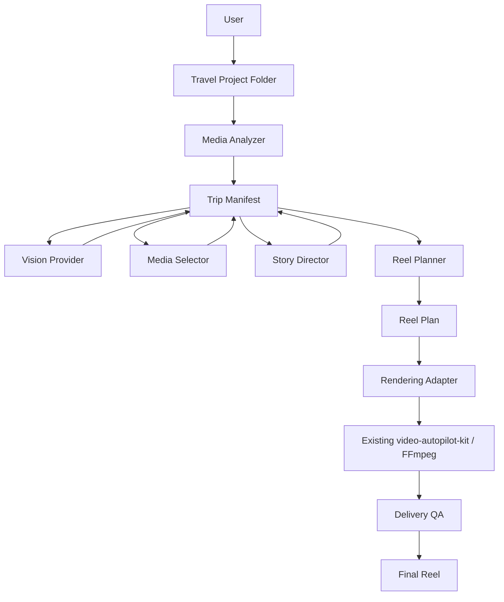
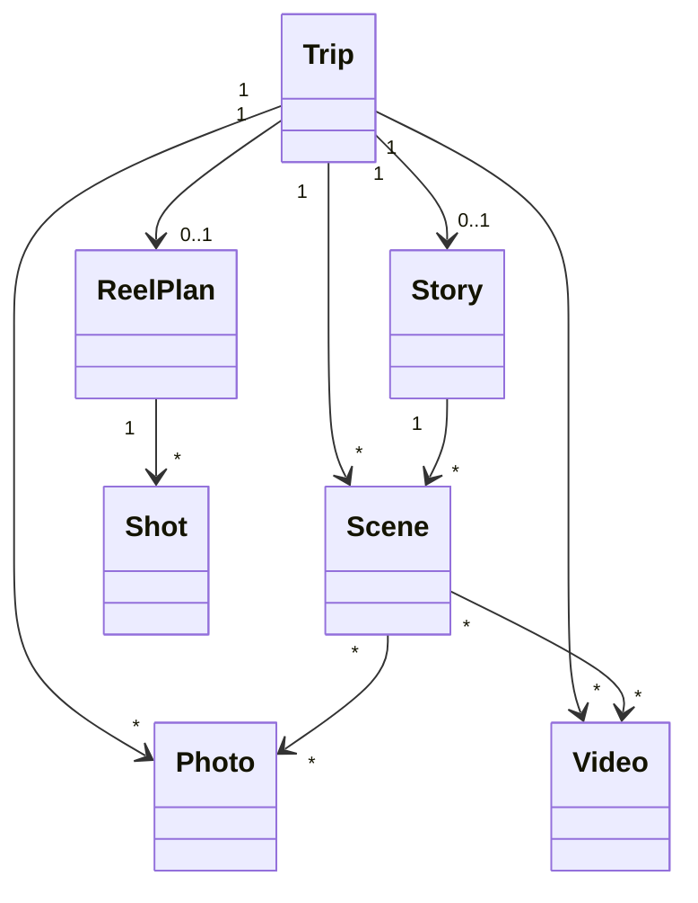

# AI Travel Reel Generator — System Architecture Specification

**Document Version:** 1.0
**Architecture Status:** Baseline
**Product:** AI Travel Reel Generator
**Repository:** `video-autopilot-kit`

---

## 1. Purpose

This document defines the baseline software architecture for the **AI Travel Reel Generator**.

The product transforms a folder of travel photos and videos into an approximately 40-second vertical Reel through automated media analysis, selection, storytelling, edit planning, rendering, and quality validation.

This specification defines:

* system boundaries
* module responsibilities
* canonical data flow
* dependency rules
* AI boundaries
* rendering boundaries
* persistence strategy
* extensibility requirements
* MVP success criteria

Future implementation must conform to this architecture unless an explicit Architecture Decision Record (ADR) changes it.

---

## 2. Product Mission

The core user experience is:

```text
Travel Photos + Videos
        ↓
AI understands the trip
        ↓
AI selects representative media
        ↓
AI constructs a travel narrative
        ↓
AI creates an edit plan
        ↓
Existing rendering engine executes the plan
        ↓
Publish-ready vertical Reel
```

The target is not a general-purpose video editor.

The product acts as an **AI Travel Director**.

AI makes editorial decisions.

The deterministic media pipeline executes those decisions.

---

## 3. MVP Definition

### Input

One travel project directory containing:

```text
Trip/
├── Photos/
└── Videos/
```

Additional assets such as music may be supported but are not mandatory input for the initial MVP.

### Output

One publish-ready video:

```text
MP4
9:16
1080 × 1920
approximately 40 seconds
```

### Primary MVP objective

A user should be able to provide travel media and receive a Reel requiring little or no manual editing.

---

## 4. Architecture Principles

### 4.1 AI Decides; Renderer Executes

AI modules may:

* understand media
* classify content
* evaluate quality
* rank media
* select media
* construct narrative
* plan shots
* recommend timing
* recommend transitions

AI modules must not directly execute FFmpeg rendering.

Rendering remains deterministic.

---

### 4.2 Preserve Existing Rendering Assets

Existing `video-autopilot-kit` capabilities are reusable infrastructure.

In particular:

```text
silent_vlog_maker
capcut_helpers
FFmpeg utilities
caption utilities
effects
delivery QA
```

must not be unnecessarily rewritten.

The new `travel_reel` package acts as an orchestration and intelligence layer above existing capabilities.

---

### 4.3 Single Source of Truth

`trip_manifest.json` is the persistent project-state representation.

It contains or references:

* trip metadata
* photos
* videos
* AI analysis
* selection decisions
* scene assignments
* story state
* timeline state
* rendering intent

`analysis.json` remains an analyzer artifact containing objective scan results.

It must not become the primary mutable project state.

---

### 4.4 Inspectable AI Decisions

AI decisions must remain inspectable.

The system should make it possible to determine:

* why a media item was selected
* why a media item was rejected
* its quality score
* its semantic tags
* its assigned scene
* its narrative role
* its planned duration

The product must avoid an opaque:

```text
folder → AI → final.mp4
```

architecture.

---

### 4.5 Provider Independence

AI providers are infrastructure dependencies, not domain logic.

The architecture must permit providers such as:

```text
OpenAI
Gemini
Qwen-VL
other local or cloud vision models
```

without redesigning Selector, Story Director, Planner, or Renderer.

---

### 4.6 Incremental Processing

Expensive analysis should not be repeated unnecessarily.

For example:

```text
Media Analyzer
        ↓
metadata persisted
        ↓
Vision analysis
        ↓
vision result persisted
        ↓
Selector
```

A change to the story should not require rescanning all source files.

A change to rendering style should not require rerunning Vision.

---

### 4.7 Deterministic Boundaries

Where practical, deterministic software should handle:

* file discovery
* metadata extraction
* media probing
* serialization
* duration calculations
* timeline validation
* FFmpeg execution
* delivery QA

AI should be used only where semantic or editorial judgment provides material value.

---

## 5. System Context



---

## 6. Logical Layers

The system is divided into five logical layers.

### Layer 1 — Ingestion

Responsible for discovering and probing source media.

Primary component:

```text
Media Analyzer
```

---

### Layer 2 — Understanding

Responsible for understanding what the media contains.

Primary component:

```text
Vision Provider
```

---

### Layer 3 — Editorial Intelligence

Responsible for deciding what the Reel should contain and how the trip should be presented.

Components:

```text
Media Selector
Story Director
Reel Planner
Scoring System
```

---

### Layer 4 — Execution

Responsible for translating an approved Reel Plan into media-processing operations.

Components:

```text
Rendering Adapter
Existing Renderer
FFmpeg
```

---

### Layer 5 — Validation

Responsible for determining whether the generated artifact meets delivery requirements.

Components:

```text
Delivery QA
Media validation
Output inspection
```

---

## 7. Core Processing Pipeline

The canonical processing sequence is:

```text
Trip Folder
    ↓
Media Analyzer
    ↓
Trip Manifest
    ↓
Vision Analysis
    ↓
Media Scoring
    ↓
Event / Scene Intelligence
    ??
Media Selection
    ↓
Scene Construction
    ↓
Story Direction
    ↓
Reel Planning
    ↓
Rendering Adapter
    ↓
FFmpeg / Existing Renderer
    ↓
Delivery QA
    ↓
Final Reel
```

A later stage must not silently perform the responsibility of an earlier stage.

---

## 8. Component Responsibilities

### 8.1 Media Analyzer

Responsibilities:

* recursive media discovery
* photo/video classification
* EXIF extraction
* capture-time extraction
* GPS extraction where available
* resolution detection
* orientation detection
* video duration detection
* codec/fps metadata when required
* file-size collection
* deterministic media IDs

Outputs objective facts.

Must not:

* decide whether a photo is good
* select media
* infer a story
* create a timeline
* render video

---

### 8.2 Vision Provider

Responsibilities:

* semantic image/video understanding
* content description
* object/category detection
* scene-type classification
* landmark hints when reliable
* people/activity observations
* visual-quality signals that require semantic understanding

Must not:

* choose final Reel media
* determine story order
* allocate final clip durations
* invoke the renderer

Vision results must be persisted so that changing downstream editorial logic does not require repeated Vision calls.

---

### 8.3 Scoring System

Responsibilities:

Produce normalized quality/editorial signals used by the Selector.

Potential dimensions include:

* sharpness
* exposure
* composition
* subject quality
* emotional value
* uniqueness
* travel relevance
* story value
* orientation suitability
* duplicate penalty

The final scoring specification is defined separately in `scoring-system.md`.

---

### 8.4 Media Selector

Responsibilities:

Reduce the complete media library to a candidate set suitable for a short Reel.

It must consider:

* quality
* diversity
* temporal coverage
* scene coverage
* duplicate suppression
* photo/video balance
* travel relevance
* narrative usefulness

Must not:

* render media
* create FFmpeg commands
* independently perform Vision analysis

---

### 8.5 Story Director

Responsibilities:

Convert selected travel memories into a coherent narrative.

It determines concepts such as:

* opening
* arrival
* exploration
* landmarks
* food
* shopping
* activities
* atmosphere
* night scenes
* ending

The Story Director operates on travel semantics rather than raw filenames.

It must not perform rendering.

---

### 8.6 Reel Planner

Responsibilities:

Convert the story and selected media into an executable editorial plan.

It determines:

* shot order
* media IDs
* in/out points
* clip duration
* photo duration
* transition intent
* text intent
* music timing intent
* target total duration

Primary output:

```text
ReelPlan
```

The Planner describes **what should be rendered**, not how FFmpeg implements it.

---

### 8.7 Rendering Adapter

Responsibilities:

Translate `ReelPlan` into calls compatible with existing `video-autopilot-kit` rendering capabilities.

This is an anti-corruption layer between the new AI architecture and legacy/reusable rendering code.

It prevents AI-domain objects from becoming coupled to FFmpeg implementation details.

---

### 8.8 Rendering Engine

Responsibilities:

* media normalization
* vertical framing
* photo animation
* transitions
* caption rendering
* BGM processing
* audio processing
* video encoding
* MP4 creation

Existing rendering functionality should be reused whenever technically appropriate.

No AI decision logic belongs in this layer.

---

### 8.9 Delivery QA

Responsibilities:

Validate the final artifact.

Checks may include:

* expected resolution
* aspect ratio
* duration tolerance
* black-frame detection
* unexpected black borders
* silence
* audio level
* encoding compatibility
* visual contact sheet
* output-file integrity

QA failure must be distinguishable from planning failure.

---

## 9. Persistent Artifacts

The pipeline uses explicit artifacts to improve observability and debugging.

Recommended project output:

```text
output/
└── <trip-name>/
    ├── analysis.json
    ├── trip_manifest.json
    ├── reel_plan.json
    ├── preview/
    ├── logs/
    └── final/
        └── reel.mp4
```

The existing Sprint 1/2 output paths may remain backward compatible until migration is explicitly implemented.

---

## 10. Data Ownership

### `analysis.json`

Owner:

```text
Media Analyzer
```

Characteristics:

* objective
* reproducible
* mostly immutable
* generated from source media

---

### `trip_manifest.json`

Owner:

```text
Travel Reel pipeline
```

Characteristics:

* persistent project state
* progressively enriched
* contains AI-derived information
* contains editorial state

---

### `reel_plan.json`

Owner:

```text
Reel Planner
```

Characteristics:

* rendering-independent editorial contract
* deterministic input to Rendering Adapter
* inspectable before expensive rendering

---

### `reel.mp4`

Owner:

```text
Rendering Engine
```

Validated by:

```text
Delivery QA
```

---

## 11. Domain Model Overview

The core conceptual entities are:

```text
Trip
Photo
Video
Scene
Story
Timeline
ReelPlan
Shot
```

Relationships:



Detailed schemas belong in dedicated specifications and must not be duplicated here.

---

## 12. Dependency Rules

Allowed dependency direction:

```text
CLI
 ↓
Pipeline / Application Layer
 ↓
Domain + AI Services
 ↓
Adapters
 ↓
External Providers / Existing Renderer
```

Forbidden patterns include:

```text
Renderer → Story Director
Renderer → Vision Provider
Vision Provider → Renderer
Media Analyzer → Story Director
Planner → raw FFmpeg subprocess logic
Domain models → cloud AI SDK
```

Circular dependencies are prohibited.

---

## 13. AI Boundary

AI is appropriate for:

* semantic understanding
* ambiguous visual judgment
* narrative reasoning
* editorial ranking
* story construction

AI is not appropriate for deterministic tasks already solved reliably by software.

Examples:

| Task                              | Preferred mechanism |
| --------------------------------- | ------------------- |
| Detect file extension             | Deterministic       |
| Read EXIF                         | Deterministic       |
| Probe video duration              | FFprobe             |
| Calculate exact timeline duration | Deterministic       |
| Understand photo content          | Vision AI           |
| Determine travel relevance        | AI / hybrid         |
| Select diverse memories           | AI / scoring        |
| Construct narrative               | AI                  |
| Encode MP4                        | FFmpeg              |
| Verify output resolution          | FFprobe             |

---

## 14. Vision Provider Architecture

Business logic must depend on an abstract Vision interface rather than a specific vendor.

Conceptually:

```text
VisionService
    │
    ├── OpenAI Provider
    ├── Gemini Provider
    └── Local Vision Provider
```

Provider responsibilities:

* request construction
* authentication
* API interaction
* provider-specific response parsing
* normalization into internal domain results

Provider-specific schemas must not leak into the core pipeline.

---

## 15. Failure Isolation

Each pipeline stage must fail independently.

Example failure classes:

```text
MediaAnalysisError
VisionAnalysisError
SelectionError
StoryPlanningError
ReelPlanningError
RenderingError
QualityValidationError
```

A rendering failure must not require re-running Vision.

A Story Director failure must not destroy prior analysis.

Partial progress should be recoverable where practical.

---

## 16. Idempotency and Resume Strategy

Long-running or expensive operations should support reuse.

Future pipeline behavior should resemble:

```text
analyze
    ↓
persist

vision
    ↓
persist

select
    ↓
persist

story
    ↓
persist

plan
    ↓
persist

render
```

If Vision results already exist and source media has not changed, the system should be capable of reusing them.

This requirement is important for API cost, development speed, and debugging.

---

## 17. Configuration Strategy

Behavior that is expected to vary should be configuration-driven where appropriate.

Examples:

```text
target_duration
resolution
aspect_ratio
selection_count
scoring_weights
story_style
transition_policy
AI provider
AI model
```

Configuration must not contain secrets committed to Git.

API keys and credentials must use environment variables or another secure external mechanism.

---

## 18. Security and Privacy

Travel media may contain:

* people
* private locations
* GPS coordinates
* personal environments
* family members

Therefore:

* raw media must not be uploaded unnecessarily
* provider usage must be explicit
* credentials must never enter source control
* logs should avoid leaking sensitive metadata
* local-provider support remains strategically valuable

---

## 19. Observability

Every major stage should produce enough information for diagnosis.

At minimum:

```text
stage
start time
end time
input count
output count
warnings
errors
provider/model when AI is used
```

AI decisions should preserve structured reasoning signals or concise decision explanations where feasible, without depending on hidden model reasoning.

---

## 20. Repository Boundaries

Primary new application code:

```text
src/travel_reel/
```

Reusable existing engines:

```text
src/silent_vlog_maker/
src/capcut_helpers/
```

Specifications:

```text
docs/specs/
```

Tests:

```text
tests/
```

Travel examples:

```text
examples/
```

Configuration:

```text
configs/
```

The new AI architecture must not force unnecessary rewrites of existing working modules.

---

## 21. Technology Baseline

Current baseline:

* Python
* FFmpeg / FFprobe
* Pillow where required
* JSON project artifacts
* Windows development environment
* Git
* Codex-assisted implementation

Potential AI dependencies will be introduced behind provider abstractions rather than embedded directly throughout the codebase.

Remotion is not required for MVP.

CapCut automation is optional and must not become a core runtime dependency.

---

## 22. Non-Goals for V1

V1 does not require:

* general-purpose video editing
* manual nonlinear editing UI
* automatic social-media publishing
* generative image creation
* generative image-to-video
* automatic voice-over
* multi-user SaaS
* cloud rendering infrastructure
* mobile application
* arbitrary event-video generation

The initial domain remains:

> Travel photos/videos → approximately 40-second Reel.

---

## 23. V1 Success Criteria

V1 is successful when a real travel project can be processed from source media to a publishable Reel with minimal manual intervention.

Required workflow:

```text
Travel Folder
     ↓
Analyze
     ↓
Understand
     ↓
Select
     ↓
Story
     ↓
Plan
     ↓
Render
     ↓
Validate
     ↓
Final Reel
```

Required output characteristics:

* approximately 40 seconds
* 9:16
* 1080 × 1920
* coherent travel narrative
* representative media
* no obvious duplicates
* no unintended black borders
* acceptable visual rhythm
* valid MP4
* suitable for Reel/Short-style publishing

---

## 24. Architecture Quality Gates

A new feature should not be merged if it:

1. duplicates an existing rendering capability without justification
2. couples domain models directly to a specific AI vendor
3. lets AI code execute rendering directly
4. bypasses the Trip Manifest without a documented reason
5. introduces circular module dependencies
6. requires complete pipeline reruns for unrelated downstream changes
7. makes important AI decisions impossible to inspect
8. stores credentials in source control
9. expands V1 beyond the travel-Reel domain without an explicit product decision

---

## 25. Architecture Decisions

The following decisions are considered baseline decisions for V1:

**AD-001 — Travel-first scope**

The product focuses exclusively on travel Reels for V1.

**AD-002 — Existing renderer reuse**

Existing `video-autopilot-kit` rendering functionality remains the execution foundation.

**AD-003 — AI/render separation**

AI performs semantic and editorial decision-making; deterministic rendering performs media execution.

**AD-004 — Trip Manifest**

`trip_manifest.json` is the persistent Single Source of Truth for evolving project state.

**AD-005 — Inspectable pipeline**

Analysis, selection, story, planning, rendering, and QA remain separable stages.

**AD-006 — Replaceable AI providers**

AI vendor dependencies are isolated behind provider interfaces.

**AD-007 — 40-second vertical MVP**

The primary V1 target is an approximately 40-second 9:16 travel Reel.

---

## 26. Planned Specifications

This architecture is complemented by:

```text
trip-manifest.md
media-analyzer.md
vision-provider.md
scoring-system.md
media-selector.md
story-engine.md
reel-planner.md
renderer.md
mvp-checklist.md
```

Detailed component behavior belongs in those documents.

---

## 27. Architecture Baseline

This document establishes the architecture baseline for subsequent implementation.

Changes affecting:

* core data flow
* module boundaries
* SSOT strategy
* AI/render separation
* provider architecture
* rendering ownership

must be treated as architecture changes rather than ordinary feature changes.

The intended product architecture is:

> **AI understands and directs the journey; deterministic software produces the film.**
